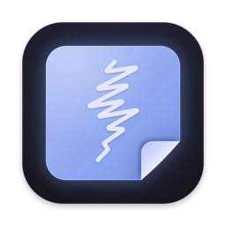
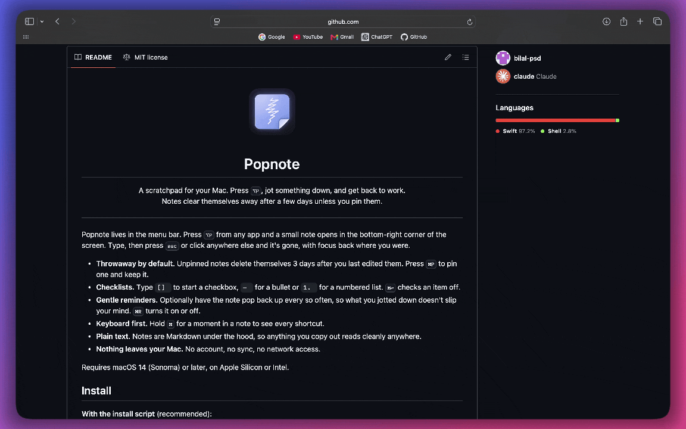
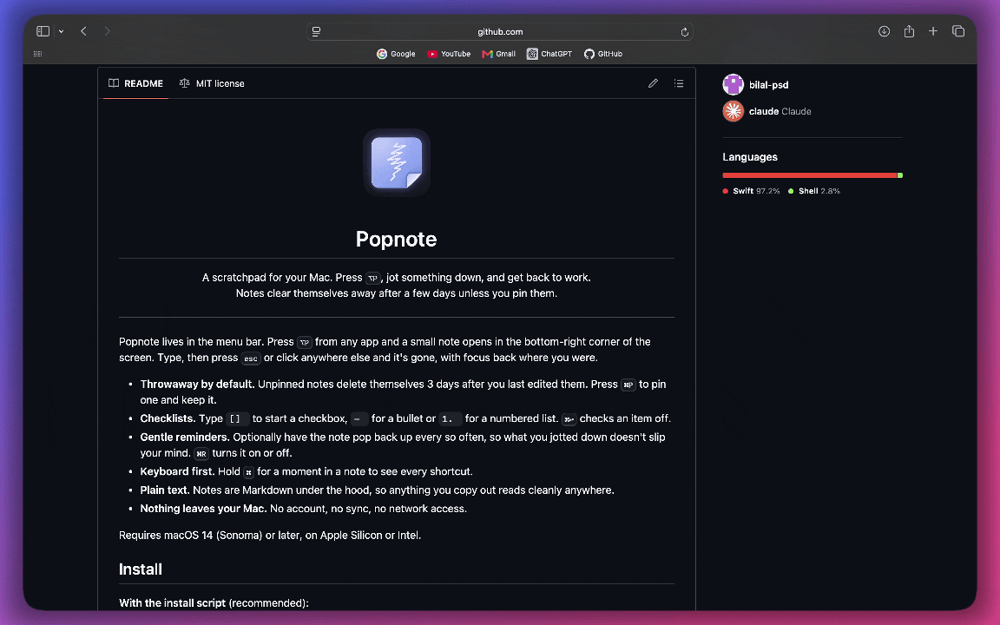

<p align="center"></p>

<h1 align="center">Popnote</h1>

<p align="center">A scratchpad for your Mac. Press <kbd>⌥P</kbd>, jot something down, and get back to work.<br>Notes clear themselves away after a few days unless you pin them.</p>

<p align="center"></p>

---

Popnote lives in the menu bar. Press <kbd>⌥P</kbd> from any app and a small note opens in the bottom-right corner of the screen. Type, then press <kbd>esc</kbd> or click anywhere else and it's gone, with focus back where you were.

- **Throwaway by default.** Unpinned notes delete themselves 3 days after you last edited them. Press <kbd>⌘P</kbd> to pin one and keep it.
- **Checklists.** Type `[] ` to start a checkbox, `- ` for a bullet or `1. ` for a numbered list. <kbd>⌘↩</kbd> checks an item off.
- **Gentle reminders.** Optionally have the note pop back up every so often, so what you jotted down doesn't slip your mind. <kbd>⌘R</kbd> turns it on or off.
- **Keyboard first.** Hold <kbd>⌘</kbd> for a moment in a note to see every shortcut.
- **Plain text.** Notes are Markdown under the hood, so anything you copy out reads cleanly anywhere.
- **Nothing leaves your Mac.** No account, no sync, no network access.

Requires macOS 14 (Sonoma) or later, on Apple Silicon or Intel.

## Install

**With the install script** (recommended):

```sh
curl -fsSL https://raw.githubusercontent.com/bilal-psd/popnote/main/install.sh | sh
```

This puts Popnote in `/Applications` and opens it. Run it again any time to update.

**With Homebrew:**

```sh
brew install --cask bilal-psd/tap/popnote
```

**Or download it** from the [latest release](https://github.com/bilal-psd/popnote/releases/latest), unzip it and drag Popnote into Applications.

### "Popnote can't be opened"

Popnote isn't notarized by Apple (that needs a paid developer account), so if you installed with Homebrew or a download, macOS blocks it the first time:

1. Open Popnote and click **Done** on the warning.
2. Go to **System Settings › Privacy & Security**, scroll down, and click **Open Anyway** next to the message about Popnote.
3. Confirm with **Open Anyway**.

You only need to do this once. The install script doesn't trigger the warning: macOS only checks apps marked as downloaded, which browsers and Homebrew do and `curl` doesn't.

## Using Popnote

| Keys | Does |
| --- | --- |
| <kbd>⌥P</kbd> | Open or close Popnote, from any app |
| <kbd>esc</kbd> | Close |
| <kbd>⌘N</kbd> | New note |
| <kbd>⌘O</kbd> | All notes, and Trash |
| <kbd>⌘[</kbd> <kbd>⌘]</kbd> | Previous / next note (or swipe with two fingers) |
| <kbd>⌘0</kbd> | Newest note |
| <kbd>⌘P</kbd> | Pin or unpin |
| <kbd>⌘⌫</kbd> | Move to Trash |
| <kbd>⌘F</kbd> | Search |
| <kbd>⌘C</kbd> | Copy the whole note (when nothing is selected) |
| <kbd>⌘↩</kbd> | Check or uncheck an item |
| <kbd>⌘+</kbd> <kbd>⌘−</kbd> | Bigger or smaller text |
| <kbd>⌘T</kbd> | Keep on top of other windows |
| <kbd>⌘R</kbd> | Turn the pop-up timer on or off |
| <kbd>⌘,</kbd> | Settings |

In a list, <kbd>↩</kbd> continues it, <kbd>↩</kbd> on an empty item ends it, and <kbd>⇥</kbd> / <kbd>⇧⇥</kbd> indent and outdent.

Settings let you change the hotkey, how long notes last, the theme (Tokyo Night, Gruvbox, Catppuccin, Solarized, Nord or the system colours), where the window opens, whether Popnote opens at login or shows in the Dock, and an optional timer that pops the note back up (off by default; every 30 minutes once turned on).

<p align="center"></p>

Deleted notes go to Trash for 7 days, so an accidental delete or an expired note can still be brought back from <kbd>⌘O</kbd> › Trash.

## Uninstall

Quit Popnote from its menu bar icon (right-click › Quit), then delete it from Applications. To remove your notes and settings as well:

```sh
rm -rf ~/Library/Application\ Support/Popnote
defaults delete io.github.bilal-psd.popnote
```

With Homebrew, `brew uninstall --zap --cask popnote` does all of this.

## Building from source

You need Apple's Command Line Tools (`xcode-select --install`) with Swift 5.10 or later.

```sh
git clone https://github.com/bilal-psd/popnote.git
cd popnote
sh scripts/bundle.sh      # builds build/Popnote.app
swift test                # runs the tests
```

`scripts/icon.swift` draws the app and menu bar icons. `scripts/release.sh` publishes a new version to GitHub Releases and the Homebrew tap.

## Licence

MIT. See [LICENSE](LICENSE). Popnote bundles [JetBrains Mono](https://github.com/JetBrains/JetBrainsMono) with [Nerd Fonts](https://www.nerdfonts.com) glyphs, under the [SIL Open Font License](Resources/Fonts/OFL.txt).
